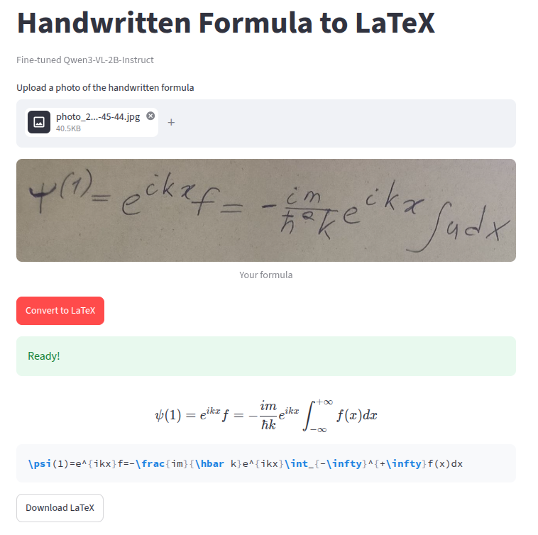

# Handwritten Mathematical Formula to LaTeX

Vision-Language Model для преобразования изображений рукописных математических формул в LaTeX.

Проект включает эксперименты с zero-shot и one-shot prompting, supervised fine-tuning модели с помощью LoRA, исследование состава обучающей выборки и гиперпараметров обучения, а также Streamlit-приложение для распознавания формул с изображений.

## Демонстрация работы приложения

Основной вариант приложения использует модель, которая показала наилучшее сочетание качества на тестовой выборке и качества на реальных фотографиях рукописных формул.

[Видеодемо приложения](https://youtu.be/pVWSxpWrHC8?si=GxL943nTxLmzKCg0)

Пример работы:



Приложение позволяет загрузить изображение рукописной формулы и получить соответствующий LaTeX-код.

## Задача

На вход модели подаётся изображение рукописной математической формулы:

**изображение → VLM → LaTeX**

Например:

```text
[изображение рукописной формулы]
             ↓
        Qwen3-VL-2B
             ↓
      \frac{a+b}{c}
```

Основная задача проекта - исследовать, насколько VLM способна распознавать математические выражения с рукописных изображений и как на качество влияют prompting, fine-tuning и состав обучающей выборки.

## Модель

В актуальной версии проекта используется:

**[`unsloth/Qwen3-VL-2B-Instruct-unsloth-bnb-4bit`](https://huggingface.co/unsloth/Qwen3-VL-2B-Instruct-unsloth-bnb-4bit)**

Изначально в проекте использовалась **[`HuggingFaceTB/SmolVLM-256M-Instruct`](https://huggingface.co/HuggingFaceTB/SmolVLM-256M-Instruct)**, однако в процессе экспериментов модель была заменена на Qwen3-VL-2B. Основные актуальные результаты относятся к новой модели.

Для дообучения используется **LoRA**.

## Проведённые эксперименты

В проекте исследовались несколько вариантов получения предсказаний и несколько конфигураций fine-tuning.

### 1. Zero-shot

Модель получает только промпт с описанием задачи:

> Convert the handwritten mathematical formula in the image into LaTeX.

Этот режим используется как baseline для сравнения с другими подходами.

### 2. One-shot prompting

Модели дополнительно предоставляется один пример:

```text
Пример:
изображение → правильный LaTeX

Задача:
изображение → ?
```

Исследовалось влияние выбора демонстрационного примера на качество распознавания. Были протестированы несколько различных примеров из обучающей выборки. Но для взятых примеров метрика CER оказалась примерно одной и той же.

### 3. Fine-tuning

Для дообучения использовался SFT с LoRA.

В экспериментах варьировались:

* learning rate
* состав обучающей выборки

Основной обучающий датасет:

* [`linxy/LaTeX_OCR:human_handwrite`](https://huggingface.co/datasets/linxy/LaTeX_OCR/viewer/human_handwrite)

Дополнительно использовалась часть датасета:

* [`deepcopy/MathWriting-human`](https://huggingface.co/datasets/deepcopy/MathWriting-human)

### 4. Сравнение состава обучающей выборки

Отдельно исследовалось влияние добавления рукописных примеров из `MathWriting-human`.

Это оказалось особенно интересно при проверке модели на реальных фотографиях: конфигурация с минимальным CER на тестовом датасете не обязательно давала лучший результат на фотографиях, снятых в реальных условиях.

Таким образом, в проекте отдельно рассматривались два аспекта качества:

* качество на фиксированном тестовом датасете;
* обобщение на реальные изображения.

## Результаты

Для количественной оценки используется **Character Error Rate (CER)** - расстояние между предсказанной и эталонной строками LaTeX на уровне символов.

### Тестовый датасет

Оценка проводится на тестовой выборке `linxy/LaTeX_OCR:human_handwrite`.

| Конфигурация   |   CER |
| -------------- | ----: |
| Zero-shot      | `0.373813` |
| One-shot       | `0.214301` |
| Fine-tuning #1  (train dataset: only linxy; lr=1e-5) | `0.041104` |
| Fine-tuning #2 (train dataset: only linxy; lr=1e-4) | `0.002156` |
| Fine-tuning #3 (train dataset: linxy:deepcopy=1:1; lr=1e-5) | `0.039680` |
| Fine-tuning #4 (train dataset: linxy:deepcopy=1:1; lr=1e-3) | `0.004333` |

> В таблицу вынесены основные конфигурации экспериментов. Подробные параметры и промежуточные результаты находятся в `notebooks/training_evaluation.ipynb`.

### Тестирование на реальных изображениях

Помимо benchmark-теста, модели проверялись на собственных фотографиях рукописных формул.

Интересный результат экспериментов:

> Модель с лучшим CER на тестовой выборке не оказалась лучшей на реальных изображениях.

Модель, обученная на `linxy` с добавлением части `MathWriting-human`, показала более устойчивое поведение на реальных фотографиях, несмотря на то, что другая конфигурация имела лучший результат на тестовом датасете.

Это показывает влияние **domain shift** между данными benchmark-а и реальными фотографиями.

### Видеодемонстрации разных моделей

Видеодемонстрации приложения с другими моделями:

* [модель с лучшим результатом на тестовом датасете](https://youtu.be/PmC_WutJTec?si=4mPDkGkvw33rayuL)
* [исходная версия проекта на `SmolVLM-256M`](https://youtu.be/--kOWz4kNW8?si=nsyCrevkExBHNpg4)

## Архитектура

Основной pipeline:

```text
Streamlit app
    │
    ▼
Изображение
    │
    ▼
Qwen3-VL-2B
    │
    ▼
LaTeX prediction
    │
    ▼
Post-processing
    │
    ▼
Streamlit app
```

## Установка

```bash
git clone https://github.com/vys-leon/vlm-handwriting-to-latex.git
cd vlm-handwriting-to-latex
pip install -r requirements.txt
```

После установки:

```bash
streamlit run app.py
```

## Оценка модели

Для расчёта CER на тестовой выборке:

```bash
python -m src.evaluate
```

Для запуска inference:

```bash
python -m src.inference
```

Основные эксперименты и результаты находятся в:

```text
notebooks/training_evaluation.ipynb
```

## Структура проекта

```text
.
├── notebooks/
│   ├── old_model.ipynb
│   └── training_evaluation.ipynb
│
├── screenshots/
│   ├── test_image.jpg
│   └── work_example.png
│
├── src/
│   ├── __init__.py
│   ├── evaluate.py
│   ├── functions.py
│   └── inference.py
│
├── app.py
├── requirements.txt
└── README.md
```

### Назначение основных файлов

* `app.py` - Streamlit-приложение
* `src/inference.py` - inference модели
* `src/evaluate.py` - оценка качества на тестовой выборке
* `src/functions.py` - вспомогательные функции
* `notebooks/training_evaluation.ipynb` - обучение, эксперименты и оценка
* `notebooks/old_model.ipynb` - эксперименты с предыдущей версией модели
* `screenshots/` - пример работы приложения

## Технологии

* Python
* PyTorch
* Hugging Face Transformers
* Hugging Face Datasets
* PEFT / LoRA
* Qwen3-VL
* Streamlit
* jiwer

## Основные результаты проекта

В рамках проекта были:

* реализованы zero-shot и one-shot режимы inference
* исследовано влияние выбора демонстрационного примера в one-shot
* выполнено fine-tuning VLM с помощью LoRA
* исследовано влияние learning rate
* исследовано влияние состава обучающей выборки
* проведено сравнение качества на тестовой выборке и реальных фотографиях
* разработано Streamlit-приложение для демонстрации модели

Отдельный вывод экспериментов - оптимизация под CER на тестовой выборке не всегда приводит к лучшему качеству на реальных данных, поэтому при выборе итоговой модели учитывалось не только значение метрики на тестовом датасете, но и поведение на реальных изображениях.
