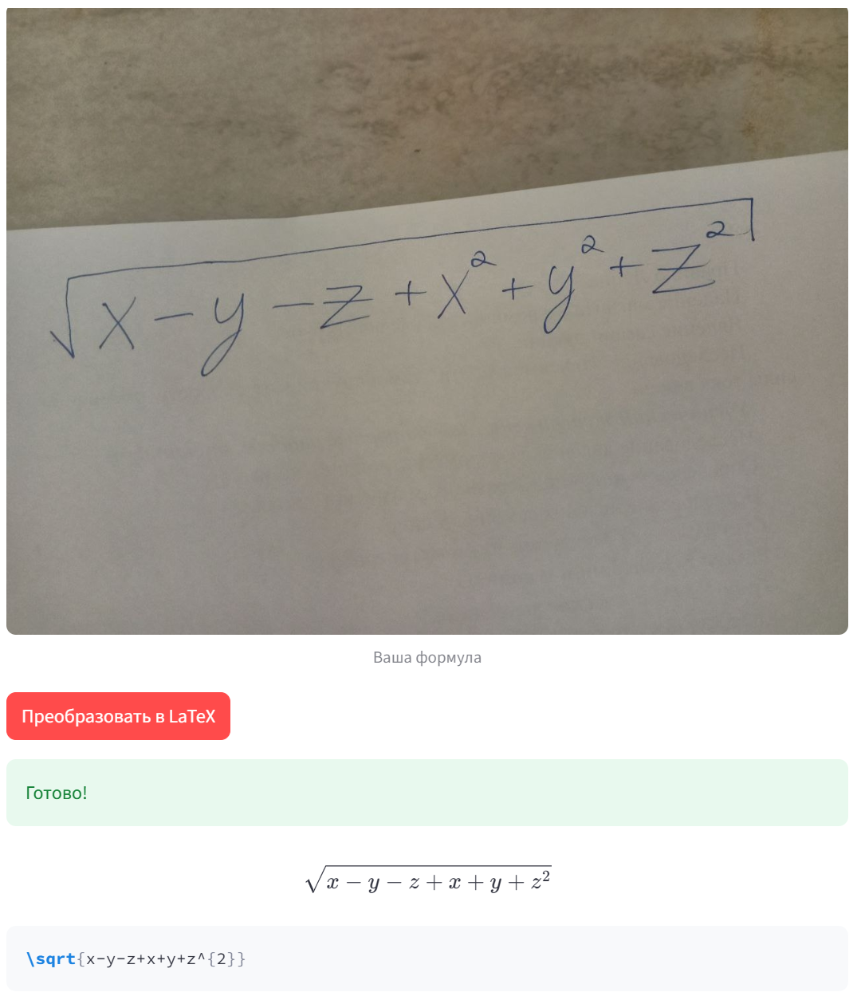

# Handwritten Mathematical Formula to LaTeX

Vision-Language Model Fine-Tuning + Streamlit Application

Converts images of handwritten mathematical formulas into LaTeX code using a fine-tuned SmolVLM-256M-Instruct model.

Example of how the application works:



All screenshots are available in the [screenshots/](screenshots/) folder.

[Watch full demo on YouTube](https://youtu.be/--kOWz4kNW8)

## Results (on `linxy/LaTeX_OCR:test`, 70 examples)

| Setup                              | CER     | Change vs Zero-shot |
|------------------------------------|---------|---------------------|
| **Zero-shot (baseline)**               | **0.1846**  | **-**                   |
| One-shot                           | 0.1990  | -7.8%               |
| SFT (linxy/LaTeX_OCR:train only)   | 0.1881  | -1.9%               |
| SFT (linxy/LaTeX_OCR + MathWriting-human) | 0.1859 | -0.7%      |

Metric: Character Error Rate (CER) - suitable for LaTeX generation quality.

## Features
- Zero-shot and One-shot inference
- Supervised Fine-Tuning (SFT) with LoRA
- Real-time Streamlit web application (upload photo --> rendered LaTeX)
- Tested on the official test set (`linxy/LaTeX_OCR:test`, 70 examples)
- Tested on real photos of handwritten formulas

## Training Details

- Base model: `HuggingFaceTB/SmolVLM-256M-Instruct`
- Fine-tuning method: LoRA
- Datasets:
  - [linxy/LaTeX_OCR](https://huggingface.co/datasets/linxy/LaTeX_OCR)
  - [deepcopy/MathWriting-human](https://huggingface.co/datasets/deepcopy/MathWriting-human)
- Training config: r=16, lora_alpha=16, lora dropout=0, finetune vision layers: True, \
finetune language layers: True, finetune attention modules: True, finetune mlp modules: True, \
max_steps=30, learning_rate=1e-5, optimizer=adamw_8bit, weight_decay=0.01, lr_scheduler_type=linear, \
max_length=2048
- Hardware: Laptop GeForce RTX 3070 Ti (8 GB VRAM)

## Trained Models (Hugging Face)
- [SmolVLM-256M-SFT-linxy](https://huggingface.co/Azaper/SmolVLM-256M-SFT-linxy) - trained on linxy only
- [SmolVLM-256M-SFT-linxy-deepcopy](https://huggingface.co/Azaper/SmolVLM-256M-SFT-linxy-deepcopy) - trained on linxy + MathWriting-human

## Quick Start

### 1. Installation
```bash
git clone https://github.com/vys-leon/vlm-handwriting-to-latex.git
cd vlm-handwriting-to-latex
pip install -r requirements.txt
```

### 2. Run Streamlit App
```bash
streamlit run app.py
```
Then open your browser at http://localhost:8501 and upload a handwritten formula image.

### 3. Model Inference
```bash
python src/inference.py
```

### 4. Evaluate CER on Test Set
```bash
python src/evaluate.py
```

### Repository Structure
```text 
|-- notebooks/
|   |__ training_evaluation.ipynb   # Training with LoRA + evaluation
|-- screenshots/
|   |-- my_handwritten_test.png
|   |-- my_image.jpg
|   |-- one_shot_example.png
|   |__ zero_shot_example.png
|-- src/
|   |-- evaluate.py                 # CER evaluation on test set
|   |__ inference.py                # model inference
|-- app.py                          # Streamlit application
|-- README.md
|-- report.md
|__ requirements.txt
```

### Technologies
- PyTorch, Hugging Face Transformers, PEFT (LoRA)
- Streamlit (web deployment)
- datasets (Hugging Face datasets)

### Future work
- Experiments with models (choose another models)
- Experiments with one-shot inference (choose different example images)
- Experiments with prompts
- Hyperparameters tuning during fine-tuning
- Deploy to Hugging Face Spaces / Docker container
